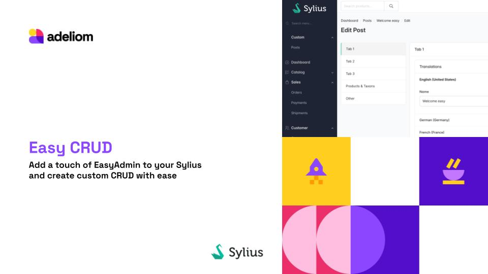
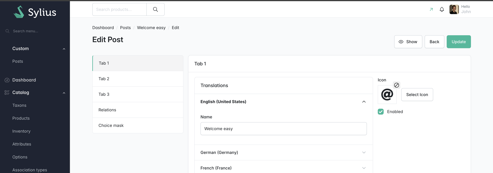

<div align="center">

# Sylius Easy CRUD Plugin


</div>




<div align="center">

[Overview](#overview) • [Installation](#installation) • [Quick Start](#quick-start) • [Documentation](#documentation)

</div>

---

## Overview

#### **Sylius Easy CRUD Plugin** is an abstraction layer that helps building CRUD interfaces in Sylius e-commerce.

🧩 Define your entire CRUD interface (list, create, edit, show, delete) in a single `configureFields()` method on a `App\Admin\ResourceAdmin` class based on Sylius resources — similar to EasyAdminBundle, but integrated with Sylius!

🚀 With this `Admin class` this plugin generates automatically all CRUD interfaces for you: `Grid`, `Creation/Edition forms`, `Show page`, and preconfigured CRUD `Actions`. It also provides a rich set of `form field types` that helps you build forms with minimal code.

✨ Transform Symfony entities / Sylius resources into fully functional admin interfaces in minutes!



```php
class PostAdmin extends AbstractAdmin
{
    /**
     * @return iterable<FieldInterface>
     */
    public function configureFields(string $pageName, ?string $context = null): iterable
    {

        yield TabField::new('tab1', 'Tab 1');
    
        yield ColumnField::new('tab1_left')
            ->setSize(ColumnSizeEnum::WIDE_8_OF_12);
    
        yield TranslationField::new('translations')
            ->addField(
                Field::new('name')
                ->setDisabled(false)
                ->setRequired(true)
            )
            ->onlyOnForms();
    
        yield ColumnField::new('tab1_right')
            ->setSize(ColumnSizeEnum::WIDE_4_OF_12);
    
        yield IconField::new('icon')
            ->onlyOnForms();
    
        yield CheckboxField::new('enabled');
    
        ...
    
    }
    
    /**
     * @return iterable<FilterInterface>
     */
    public function configureFilters(): iterable
    {
        yield BooleanFilter::create('enabled')
            ->setLabel('Enabled');
    }
    
    public function configureActions(string $pageName): Actions
    {
        return parent::configureActions($pageName)
            ->remove(Crud::PAGE_EDIT, Action::DELETE);
    }
}
```

### What Makes It Easy?

- **🚀 Rapid Development**: Generate complete CRUD interfaces in minutes with Symfony Maker commands
- **🎨 Rich Field Types**: 18+ specialized fields (Image, WYSIWYG, CodeEditor, Slug, Sortable Collections, and more)
- **🌍 i18n Ready**: Built-in translatable content mapped to Sylius Translation system
- **🧩 Highly Extensible**: Custom field configurators, actions, and form types
- **😎 Centralized configuration**: CRUD configuration in a single Admin class per resource

### Why we built this plugin

In our previous Symfony projects we were familiar with EasyAdminBundle and developed [several bundles based on it](https://github.com/search?q=org%3Aagence-adeliom+easy-&type=repositories). When we migrated to Sylius, we looked for a fast and efficient way to reuse those bundles, so we tried to integrate the missing parts:
- The EasyAdmin abstraction layer to allow building forms, lists and show pages in a single Admin class.
- Our previous CMS features.

We have used this bundle in production on several projects and decided to share it with the community.

It does not fully comply (yet) with last Sylius guidelines, so please use this plugin with caution.

### A duo: Easy CRUD + Happy CMS

Alongside this plugin, we migrated our other EasyAdmin-based bundles — which provided content management (CMS) features — into a separate plugin called [Happy CMS](https://github.com/agence-adeliom/sylius-happy-cms-plugin). It is an alternative for building CMS features in Sylius.

---

## Installation

### 1. Install via Composer

```bash
composer require agence-adeliom/sylius-easy-crud-plugin
composer require --dev symfony/maker-bundle
```

### 2. Enable the Bundle

Add the plugin to `config/bundles.php`:

```php
<?php

return [
    // ...
    Adeliom\SyliusEasyCrudPlugin\SyliusEasyCrudPlugin::class => ['all' => true],
   
    Symfony\Bundle\MakerBundle\MakerBundle::class => ['dev' => true, 'test' => true],
];
```

### 3. Import Configuration

In `config/packages/_sylius.yaml`:

```yaml
imports:
    - { resource: "@SyliusEasyCrudPlugin/config/config.yaml" }
```

### 4. Import Routes

In `config/routes.yaml`:

```yaml
sylius_easy_crud:
    resource: "@SyliusEasyCrudPlugin/config/routes.yaml"
```

### 5. Install Assets

```bash
php bin/console assets:install
```

---

## Quick Start

### Step 1: Generate an Entity

Create a new entity with translation support:

```bash
php bin/console make:easy-crud:create-entity Post
php bin/console doc:mig:diff
php bin/console doc:mig:mig
```

This generates:
- `src/Entity/Post.php`
- `src/Entity/PostTranslation.php`
- `src/Repository/PostRepository.php`

### Step 2: Generate the CRUD

Create a complete CRUD interface for your entity:

```bash
php bin/console make:easy-crud:create-crud Post
```

This generates:
- `src/Admin/PostAdmin.php` - CRUD configuration class
- Updates `config/routes.yaml` - Adds admin routes
- Updates `config/packages/sylius_resources.yaml` - Registers Sylius resource
- Updates `src/Menu/AdminMenuListener.php` - Adds menu entry

### Step 3: Configure Your CRUD

Edit `src/Admin/PostAdmin.php`:
Configure your fields in the `configureFields()` or your filters with `configureFilters()` method.

[Discover available fields](./docs/discover_fields.md)

### Step 4: Access Your CRUD

Navigate to your Sylius admin panel and find your new "Posts" menu entry. You now have a fully functional CRUD interface!

---

## Documentation

### 📚 User Guides

- **[Getting Started Guide](./docs/README.md)**

---

<div align="center">

**If this plugin helped you, please consider giving it a ⭐ on GitHub!**

Made with ❤️ by [Adeliom](https://www.adeliom.com/)


[](LICENSE)
[](https://php.net)
[](https://sylius.com)
[](https://packagist.org/packages/agence-adeliom/sylius-easy-crud-plugin)

</div>
